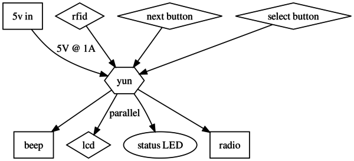
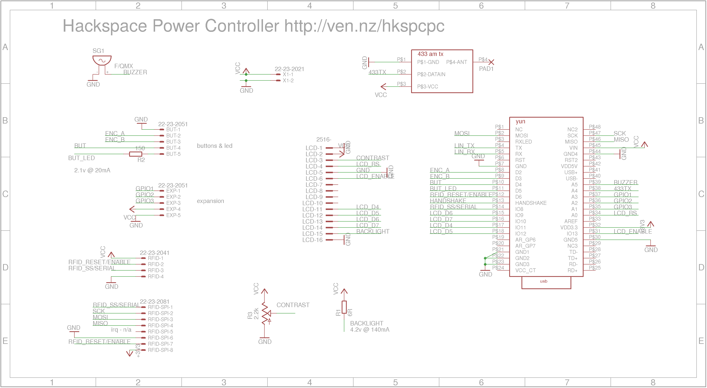
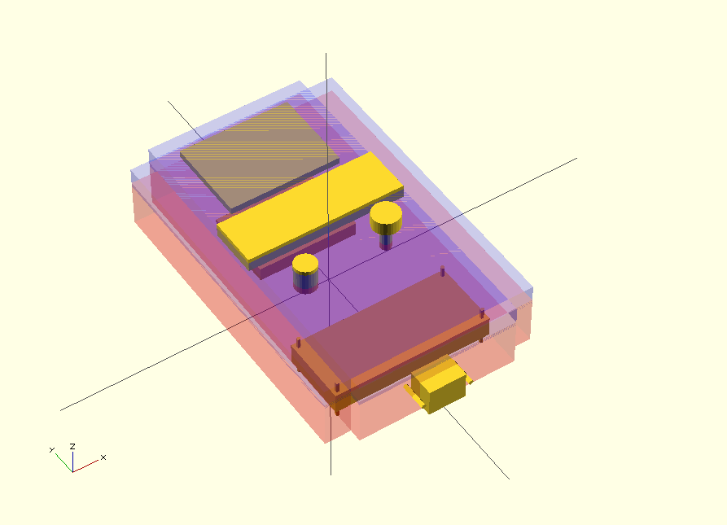

# Hackspace RFID power switch & usage logger

A system for logging usage and allowing inducted users to turn power up various machines.

Valid inducted users are fetched from a list once per day.

Inducted users use their RFID cards to turn on power to the connected machines.

Usage time is logged for maintenance and billing purposes.

Power is controlled via 433MHz remote mains power sockets.

# Software

## Design decisions

* Presenting an inducted user's RFID card will authenticate.
* Simple menu system to scroll through available tools and start/stop them.
* Never switch off/time out the connected machine in case it's a long job.
* Pull validated users once per day and store locally in case internet is unavailable.
* If internet is unavailable discard usage logging. Possible to add a queue later.

## Flowchart

## LCD messages & Menu

Menu is driven by 2 illuminated buttons: next and select.

Display after inactive for 5 seconds

    --------------------
    scan RFID to start
    goto: ven.nz/1RFvu9s

Unrecognised user.

    --------------------
    unrecognised RFID
    goto: ven.nz/1RFvu9s

user Matt recognised

    --------------------
    user: matt
    press next for tools

next button pressed - shows a tool ready to start

    --------------------
    1: lathe    inducted  
    select to start

next button pressed  - showing Nic is already using machine for 1 hour 21 secs

    --------------------
    2: mill     inducted
    nic         00:01:21

next button pressed - showing router is currently unavailable, with webpage for details

    --------------------
    3: router   offline
    goto: ven.nz/1RFvu9s

next button pressed - showing laser cutter, not inducted and webpage for detils

    --------------------
    4: laser    noinduct
    goto: ven.nz/1RFvu9s

select button pressed - showing saw available for use

    --------------------
    5: saw      inducted
    select to start

select button pressed - showing saw and option to stop

    --------------------
    5: saw      00:00:00
    select to stop

select button pressed - showing option 1 again

    --------------------
    1: lathe    inducted  
    select to start

## Beeper

Beep when:

* RFID is read
* Button is pressed

## LEDs

Both buttons have green leds. 

* Next button illuminated when valid user present
* Select button illuminated when a choice is allowed

# Electrical

## Bill of Materials

* [Arduino Yun Mini]() - [datasheet](datasheets/Arduino-yun-mini-schematics.pdf)
* [RFID reader](http://uk.rs-online.com/web/p/products/6666625/) - [datasheet](http://docs-europe.electrocomponents.com/webdocs/0d16/0900766b80d1684b.pdf)
* [LCD 2x20](http://uk.rs-online.com/web/p/products/7200222/) - [datasheet](http://docs-europe.electrocomponents.com/webdocs/0f25/0900766b80f25e5b.pdf)
* [case](http://uk.rs-online.com/web/p/products/3648223/) - [datasheet](http://uk.rs-online.com/web/p/products/3648223/)
* [433MHz ASK radio transmitter](http://uk.rs-online.com/web/p/lower-power-rf-modules/6172072/) - [datasheet](http://docs-europe.electrocomponents.com/webdocs/087d/0900766b8087d2df.pdf)
* [2 switches](http://uk.rs-online.com/web/p/push-button-switches/8207533/) - [datasheet](http://docs-europe.electrocomponents.com/webdocs/1388/0900766b8138874b.pdf)
* [buzzer](http://uk.rs-online.com/web/p/piezo-buzzer-components/7716910/) - [datasheet](http://docs-europe.electrocomponents.com/webdocs/1168/0900766b811685e8.pdf)

## Wiring

## Schematic

For interconnects, power and buzzer.

## Case design

[generated with openscad file case.scad](case/case.scad)

All measurements in mm and stated as L x W x D

* Yun + PCB = 70 x 85 x 10
* RFID = 62 x 82 x ?
* LCD = 37 x 116 x ?
* Buttons = 8 x 20

Modelling the layout led to a case size of 280 x 120 x 90mm.
But these dimensions didn't yield many cases! So I looked for some common sizes
and found some that were 240 x 120 x 100mm. Setting the openscad case dimensions
to these figures allowed me to move things about to check fit.

# Shortcomings

* In many cases easy to bypass, but as used in a trusting environment, not seen as a big issue. A locking box could be made out of wood that would contain an extension lead end, the radio power switch and the end of the machine cable.

# Licenses

* Hardware is licensed under the [CERN open hardware license 1.2](http://www.ohwr.org/attachments/2388/cern_ohl_v_1_2.txt)

* Software is licensed under a Creative Commons Attribution 4.0 International License.
