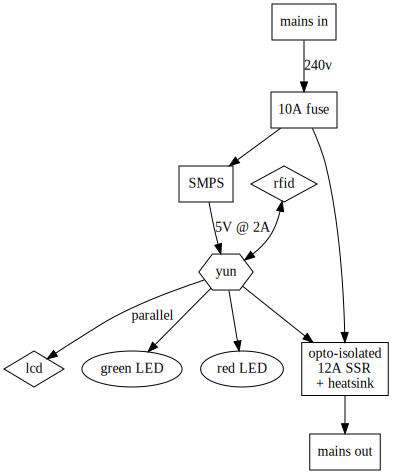

# Arduino Yun

# Hackspace tool logger/lockout

## Hardware plan

## Software plan

## Parts list

* Arduino Yun
* case
* PSU
* RFID reader
* SSR
* LCD 2x20
* fused power inlet
* power outlet
* green & red LEDs

## Case

All measurements in mm and stated as L x W x D

* Yun = 73 x 53 x ?
* SSR + heatsink = 100 x 55 x 67
* PSU = 105 x 50 x 18
* LED = 12mm diameter
* RFID = 62 x 82 x ?
* IEC inlet/outlet/fuse = 32.5 x 79.2 (hole size for 1.5mm panel thickness) x 32.3 depth
* LCD = 37 x 116 x ?
