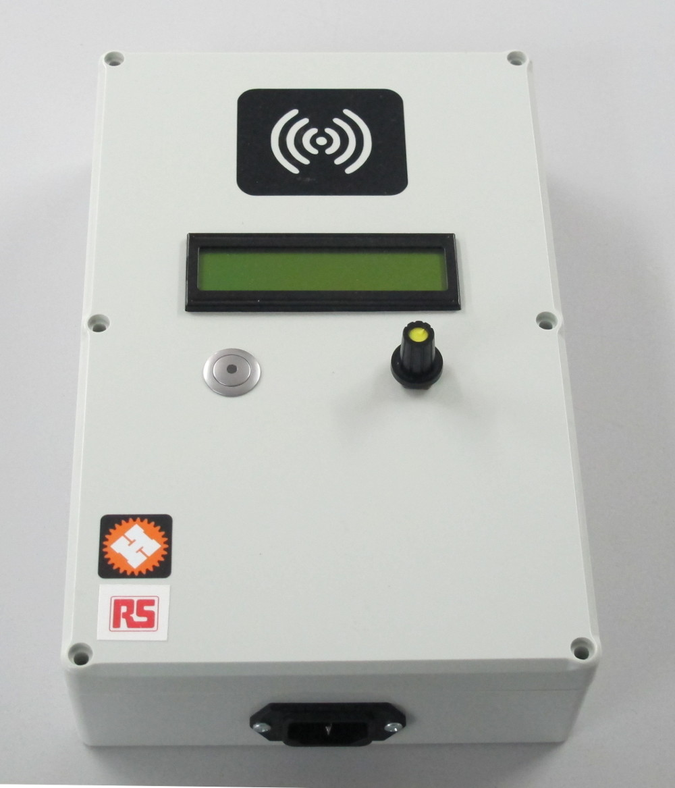

# Hackspace machine access & usage logger

A system for allowing inducted users to turn power on to various machines. 

* Users are authenticated with RFID.
* Usage time is logged to a [google spreadsheet](https://docs.google.com/spreadsheets/d/1C3qdswIIFLBH4fQWuWFZRTpnnRjpzyk5xHRKnjuHExU/edit?usp=sharing).
* Inducted users are managed using the same spreadsheet.
* Tools are turned on and off with wireless mains plugs.

Shortlink: [http://ven.nz/hkspcpc](http://ven.nz/hkspcpc)

Sponsored by [RS Components](http://uk.rs-online.com/web/)

## Pros

Cheap to implement as only need one central internet connected RFID reader and then very cheap
remote plugs for equipment.

Easy management for equipment managers via a google spreadsheet.

## Cons

Users will probably forget to 'log out' and clock up long machine run times.
Systems in use at [London
Hackspace](https://wiki.london.hackspace.org.uk/view/Project:Tool_Access_Control)
and [Nottingham Hackspace](https://wiki.nottinghack.org.uk/wiki/Nhtools) both
require the user's RFID card to remain in place while the machine is on, thus
making it less likely the user will leave the machine running.

Without covering/hacking the remote plugs; easy to bypass.

# Software

Split into:

* [Arduino code](software/power_controller/) for UI, RFID and radio. 
* [Python code](software/python/) for local caching, internet logging.

## Design decisions

* Presenting an inducted user's RFID card will authenticate.
* Simple menu system to scroll through available tools and start/stop them.
* Never switch off/time out the connected machine in case it's a long job.
* Allow an inducted user to end another user's session in case they left it
 running accidentally.
* Pull tools & validated users once per hour and store locally in case internet is unavailable.
* If internet is unavailable discard usage logging. Possible to add a queue later.

# Electrical

## Bill of Materials

See the [bom](electronics/bom.md)

## Schematic

[Eagle cad files](electronics) including [single layer PCB
layout](electronics/board.png)

## Case design

[Case design](case/case.md) [generated with openscad file case.scad](case/case.scad)

# Project log

[Project log details design, build and testing](project_log.md)

# Licenses

* Hardware is licensed under the [CERN open hardware license 1.2](http://www.ohwr.org/attachments/2388/cern_ohl_v_1_2.txt)

* Software is licensed under a Creative Commons Attribution 4.0 International License.
