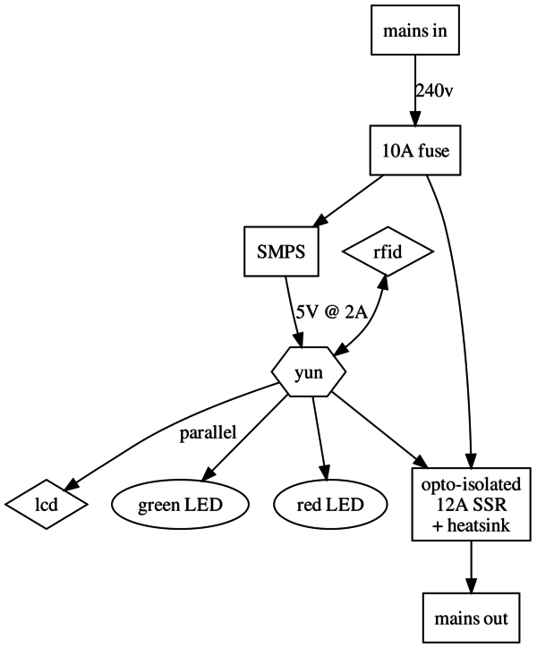
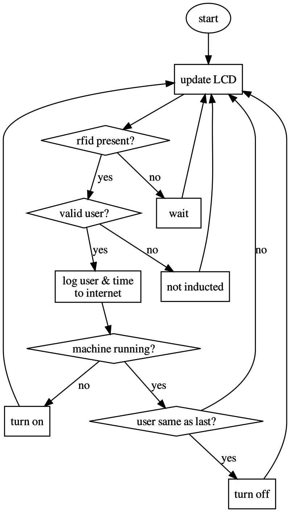
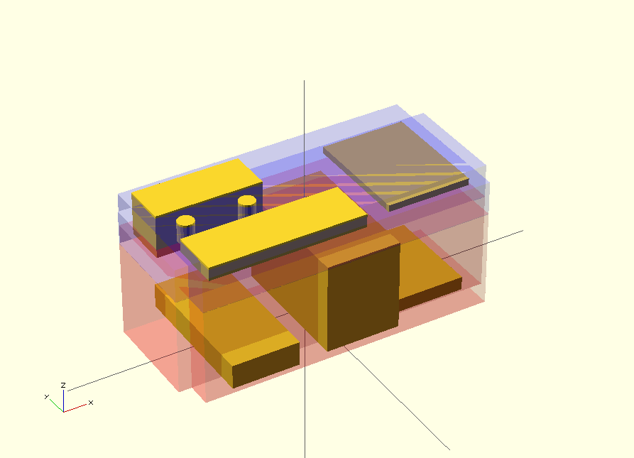

# Hackspace RFID power switch & usage logger

A system for logging usage and only allowing an inducted user to turn on power
to a machine.

## Electrical components & wiring

## Software plan

### LEDs

* Red LED under the inlet IEC comes on with Yun at boot.
* Green under outlet IEC comes on with SSR.

### LCD messages

status: wifi good, SSR on. user Matt logged in, using machine for 1:10

    --------------------
    s: WP       t: 01:10
    u: matt

status: wifi is bad, power is off. No-one logged in. 

    --------------------
    s: wp       t: 00:00
    goto: ven.nz/1RFvu9s

Unrecognised user.

    --------------------
    s: wp       t: 00:00
    u: unrecognised

* t = time the SSR has been on
* u = username of user who turned on SSR
* s = status (see below)

#### Status

Capital letter means true, lower; false

* W wifi
* P power is supplied to IEC outlet

## Parts list

* [Arduino Yun](http://uk.rs-online.com/web/p/products/7824594/)
* [10W 5V PSU](http://uk.rs-online.com/web/p/products/0327936/)
* [RFID reader](http://uk.rs-online.com/web/p/products/6666625/)
* [12A SSR](http://uk.rs-online.com/web/p/products/1718904/) and [heatsink](http://uk.rs-online.com/web/p/products/1719070/)
* [LCD 2x20](http://uk.rs-online.com/web/p/products/7200222/)
* [fused power inlet/outlet](http://uk.rs-online.com/web/p/products/6112092/)
* [green](http://uk.rs-online.com/web/p/products/0206514/) & [red](http://uk.rs-online.com/web/p/products/0206508/) LEDs
* [beeper](http://uk.rs-online.com/web/p/products/5117636/)
* [temperature sensor TMP36](http://uk.rs-online.com/web/p/products/0427351/)
* [case](http://uk.rs-online.com/web/p/products/3648223/)

## Case

[generated with openscad file case.scad](case.scad)

All measurements in mm and stated as L x W x D

* Yun = 73 x 53 x ?
* SSR + heatsink = 100 x 55 x 67
* PSU = 105 x 50 x 18
* LED = 12mm diameter
* RFID = 62 x 82 x ?
* IEC inlet/outlet/fuse = 32.5 x 79.2 (hole size for 1.5mm panel thickness) x 32.3 depth
* LCD = 37 x 116 x ?

Modelling the layout led to a case size of 280 x 120 x 90mm.
But these dimensions didn't yield many cases! So I looked for some common sizes
and found some that were 240 x 120 x 100mm. Setting the openscad case dimensions
to these figures allowed me to move things about to check fit.

### Design decisions

Keep the PSU and the RFID reader on opposite sides of the case, hopefully reducing interferance from the switched mode PSU.

Put all external components on the lid to simplify cutting the holes.

Put the LEDs under the relevant IEC sockets to make it obvious when there is
power supplied and provided.

## Shortcomings

* Super easy to bypass, but as used in a trusting environment, not seen as a big issue
